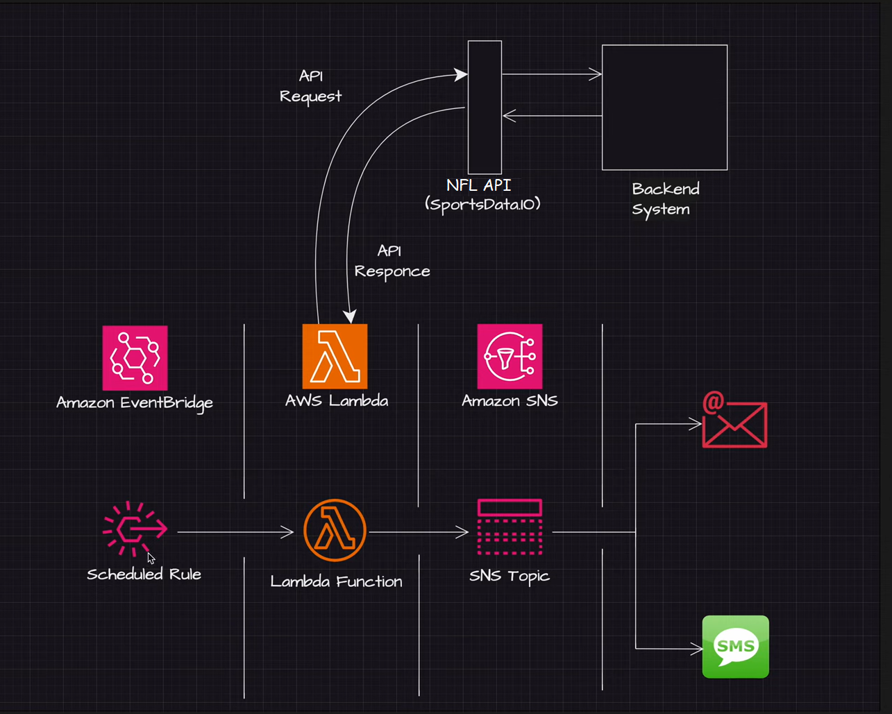
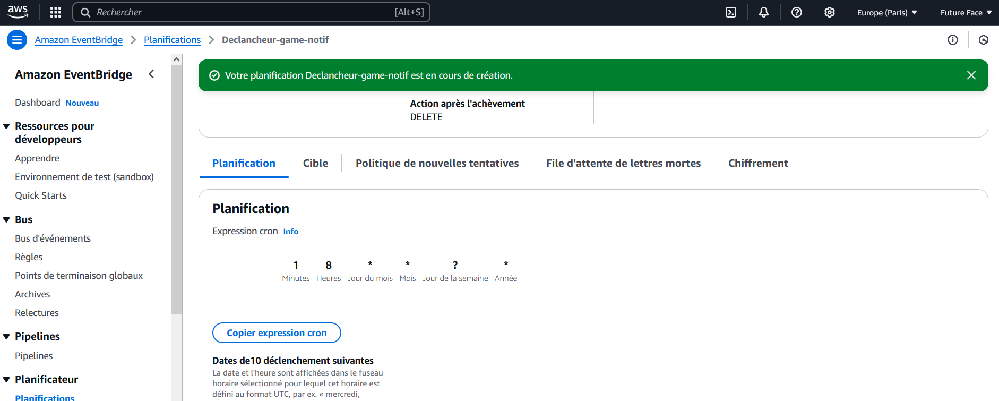
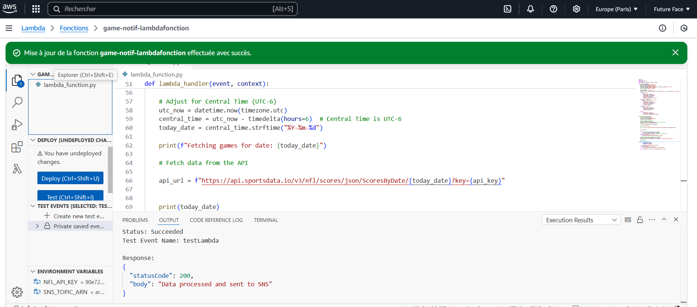
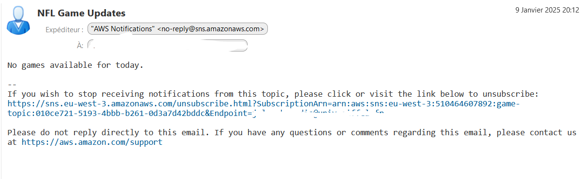
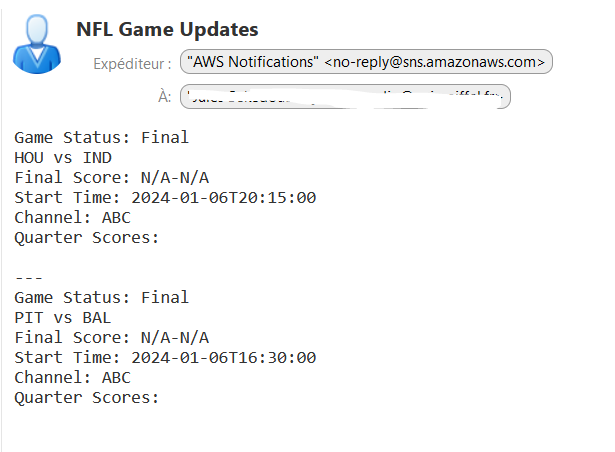

# Notifications de matchs de la NFL / Système d'alerte sportive

## **Vue d'ensemble**
Ce projet est un système d'alerte qui envoie des notifications de scores de la NFL en temps réel aux utilisateurs abonnés via SMS/Email. Il exploite**Amazon SNS**, **AWS Lambda** et **Python**, **Amazon EvenBridge** et les API NFL pour fournir aux fans  des informations de match à jour. Le projet démontre les principes du cloud et des mécanismes de notification efficaces.

---

## **Fonctionnalités**

- Info en live sur les matchs de la NFL via l'API sportsdata.io .
- Envoie les mises à jour de scores formatées aux abonnés par SMS/Email en utilisant Amazon SNS.
- Automatisation programmée pour les mises à jour régulières à l'aide d'Amazon EventBridge.
- Conception suivant le principe du moindre privilège pour les rôles de l'IAM.


## **Prérequis**
- Clé API  [sportsdata.io](https://sportsdata.io/)
- Compte AWS personnel avec une compréhension de base de l'AWS et de Python

---

## ** Architecture technique**



---


## **Technologies**
- **Cloud** : AWS
- **Services Principaux**: SNS, Lambda, EventBridge
- **API Externe**: NBA Game API (SportsData.io)
- **Langage de programmation**: Python 3.x
- **Sécurité IAM**:
  - Politique du moindre privilège pour Lambda, SNS, et EventBridge.

---

## **Structure**
```bash
game-day-notifications/
├── src/
│   ├── gd_notifications.py          # Fonction Lambda
├── policies/
│   ├── gb_sns_policy.json           # Permissions de publications SNS 
│   ├── gd_eventbridge_policy.json   # Permissions EventBridge pour Lambda 
│   └── gd_lambda_policy.json        # Rôle Lambda pour son execution 
├── .gitignore
└── README.md                        
```

## **Instructions d'installation**


```bash
git clone https://github.com/sekedoua/game-notification.git
cd game-day-notifications
```

### **Création d'une rubrique (sujet) SNS **

1. Ouvrez la console de gestion AWS.
2. Naviguez jusqu'au service SNS.
3. Cliquez sur Créer un sujet et sélectionnez Standard comme type de sujet.
4. Nommez le sujet (par exemple, game-topic) et notez l'ARN.
5. Cliquez sur créer une rubrique.

### **Ajouter des abonnements au sujet du SNS **

1. Après avoir créé le sujet, cliquez sur le nom du sujet dans la liste.
2. Naviguez jusqu'à l'onglet Abonnements et cliquez sur Créer un abonnement..
3. choix du protocole :
  - Pour le courrier électronique:
    - Choisissez le courriel.
    - Saisissez une adresse électronique valide.
  - Pour le SMS (numéro de téléphone):
    - Choisissez des SMS.
    - Saisissez un numéro de téléphone valide au format international

4. Cliquez sur Créer un abonnement.
5. Si vous avez ajouté un abonnement à un e-mail:
 - Vérifiez la boîte de réception de l'adresse électronique fournie.
 - Confirmez l'abonnement en cliquant sur le lien de confirmation dans l'e-mail.
6. Pour les SMS, l'abonnement sera immédiatement actif après la création.

### **Créer la politique de publication du SNS**

1. Ouvrez le service IAM dans la console de gestion AWS.
2. Naviguez dans les politiques et créer une politique.
3. Cliquez sur JSON et collez la politique JSON à partir du fichier gd-sns-policy.json
4. Remplacer la RÉGION et le COMPORD-ID par votre région AWS et votre ID de compte.
5. Cliquez sur Suivant: Tags (vous pouvez sauter des balises en ajoutant).
6. Cliquez sur Suivant: Revue.
7. Inscrivez un nom pour la politique (par exemple  game-notif-policy).
8. Revoir et cliquer sur Créer une politique.


### **Créer un Role IAM  et l'attacher à Lambda**

1. Ouvrez le service IAM dans la console de gestion AWS.
2. Cliquez sur les rôles et créer un rôle.
3. Sélectionnez AWS Service et choisissez Lambda.
4. Joindre les politiques suivantes :
  - SNS Publish Policy (game-notif-policy) (créé à l'étape précédente).
  - Lambda Basic Execution Role (AWSLambdaBasicExecutionRole) (une politique de gestion de l'AWS).
5. Cliquez sur Suivant : Tags (vous pouvez sauter des balises en ajoutant).
6. Cliquez sur Suivant : Verifier.
7. Inscrire un nom pour le rôle (par exemple, game-notif-role).
8. Vérifier et cliquer sur Créer un rôle.
9. Copier et sauvegarder l'ARN du rôle d'utilisation dans la fonction Lambda.
 
### **Déploiement de la fonction Lambda**

1. Ouvrez la console de gestion AWS et naviguez jusqu'au service Lambda.
2. Cliquez sur Créer une fonction.
3. Sélectionnez Créer à partir de zéro.
4. Saisissez un nom de fonction (par exemple, game-notif-lambdafonction).
5. Choisissez Python 3.x  comme runtime.
6. Attribuer le rôle IAM créé précédemment (game-notif-role) à la fonction.
7. Sous la rubrique « Code de fonction » :
  - Copier le contenu du fichier src/gd-notifications.py à partir du référentiel.
  - Collez-le dans l'éditeur de code en ligne.
8. Under the Environment Variables section, add the following:
- NFL_API_KEY: votre clé API NFL.
- SNS_TOPIC_ARN: l'ARN du sujet SNS créé précédemment.
9. Cliquez sur Créer une fonction.

### **Mise en place de l'automatisation avec Eventbridge**

1. Naviguez jusqu'au service Eventbridge dans la console de gestion AWS.
2. Rendez-vous aux règles et à la création de règles.
3. Selection de la source: Planifier.
4. Définissez le calendrier cron pour quand vous voulez des mises à jour (par exemple, heure.).
5. Sous Cibles, sélectionnez la fonction Lambda (game-notif-lambdafonction) et sauvegardez la règle.


### **Tester le système**

1. Ouvrez la fonction Lambda dans la console de gestion AWS.
2. Créer un événement de test pour simuler l'exécution.
3. Exécuter la fonction et vérifier les journaux CloudWatch à la recherche d'erreurs.
4. Vérifier que les notifications Email ou SMS sont envoyées aux utilisateurs abonnés.




### **Ce que nous avons appris**

1. Concevoir un système de notification avec AWS SNS et Lambda.
2. Garantir les services AWS avec les politiques IAM du moindre privilège.
3. Automatiser les flux de travail à l'aide d'EventBridge.
4. L'intégration d'API externes dans des flux de travail basés sur le cloud.

